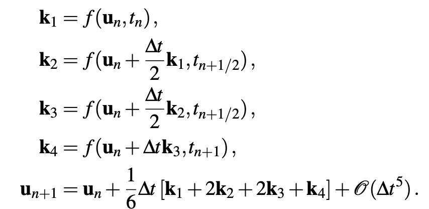

# Lab 6

The Lorenz model

<p align="center">

</p>

is a system of three nonlinearly coupled first-order ordinary differential equations.

In this lab, we will solve these equations from *t=0* to *t=100* with the initial conditions *x(0) = 1, y(0) = 1, z(0)=1*
and *a=10, b= 28, c=8/3*.

The code should output the results directly into a text file. 
The i-th line of the file should contain the values
t<sub>i</sub>, x<sub>i</sub>, y<sub>i</sub> and
z<sub>i</sub> from each time-step.

You can then plot the three-dimensional trajectory (x,y,z) in gnuplot via
```
gnuplot> splot "data" u 2:3:4
```
if you have *x,y,z* stored in the second, third and fourth column, respectively, of your file. This should give you nice looking graphs, however, they are not really suitable to compare results.
For comparison of results for different *dt* values it is more
appropriate to compare plots of e.g. *x(t)*.

-----

In this problem we use the classic fourth-order Runge-Kutta scheme:

<p align="center">

</p>

Adapted to our problem, we have  
<p align="center">

</p>
and
<p align="center">

</p>

-----
Guide for the implementation:
* At every timestep the solution is a vector that has three components.
It is reasonable to use `double` arrays of length 3 to store the results.
* The RK schemes are single-step methods, i.e. in order to make a timestep t<sub>i</sub> -> t<sub>i+1</sub> we only need the results of the previous time step. There is no need to store more than the previous result. 
* In the `main` function, loop over timesteps and organize the 
 output of the current results to the text file. 
* Implement a function `rkstep(..)` that takes the current solution at t<sub>i</sub> and calculates the solution t<sub>i+1</sub> according to the RK4 equations above.
* Implement a function `f(..)` that accepts a 3-vector **u** and calculates *f*(**u**).